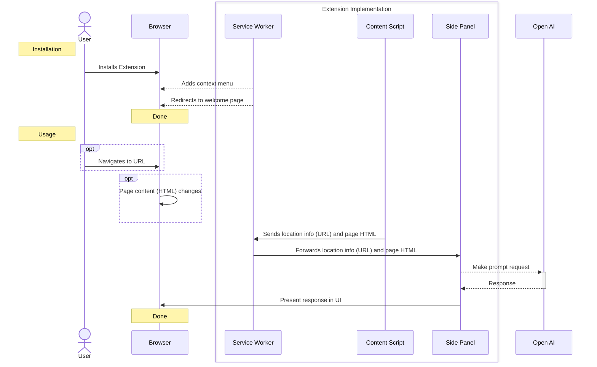

# AI CoSearch Chrome Extension

## TODO

- disable for this site
- disable for this page
- settings
    - open ai api key
    - blocklist
    - whitelist
    - ai model
    - prompt temperature
    - safety parsing
- history
    - href
    - date
    - html
- safety measures - forms, inputs, passwords, contenteditable
- convert to markdown

## Dev Resources

- [Manifest File Format](https://developer.chrome.com/docs/extensions/reference/manifest)
- [Side Panel API](https://developer.chrome.com/docs/extensions/reference/sidePanel/)
- [unpacked extension](https://developer.chrome.com/docs/extensions/mv3/getstarted/development-basics/#load-unpacked)
- [extensions reference](https://developer.chrome.com/docs/extensions/reference/)
- [samples search](https://developer.chrome.com/docs/extensions/)
- [samples repo](https://github.com/GoogleChrome/chrome-extensions-samples)

